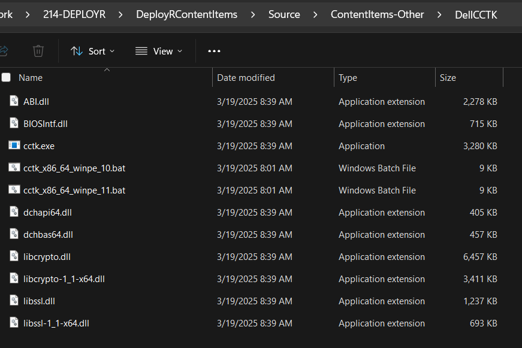
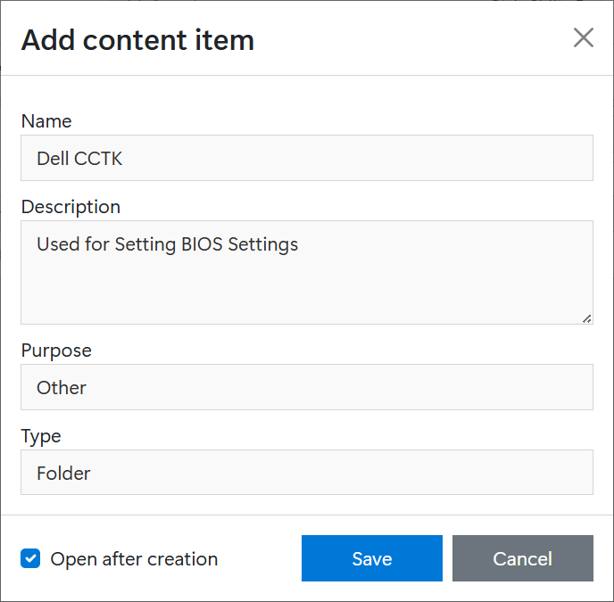
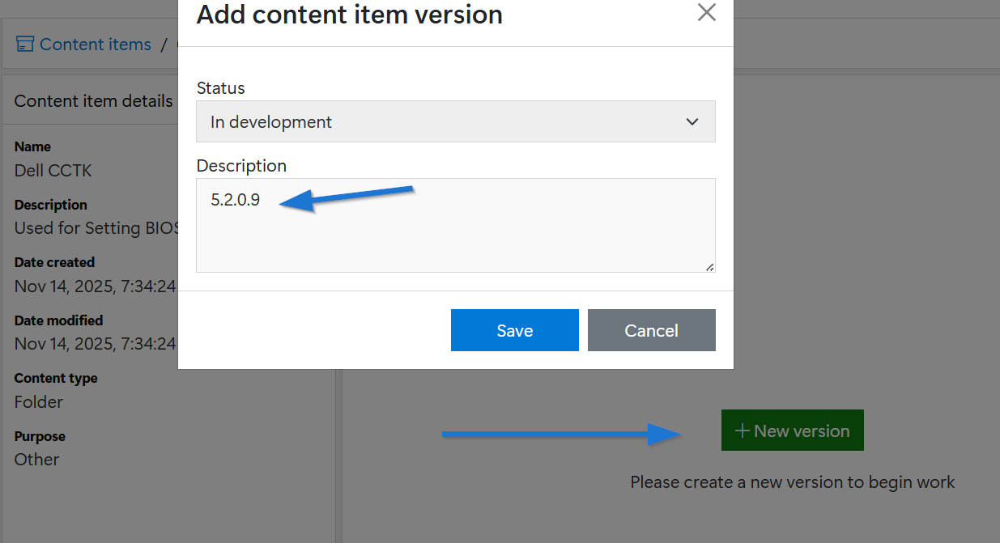
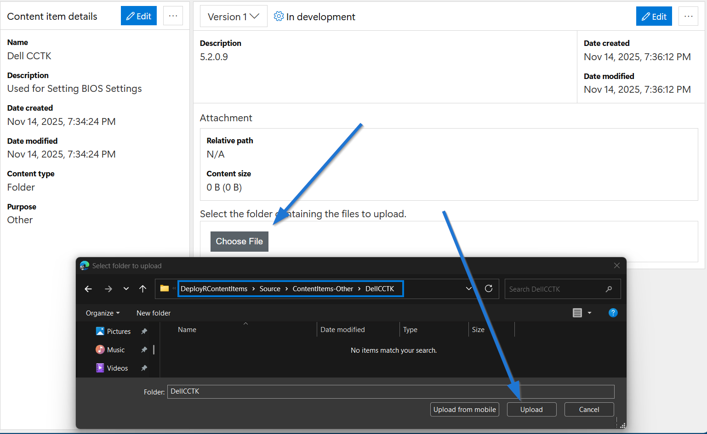
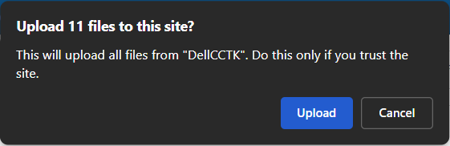
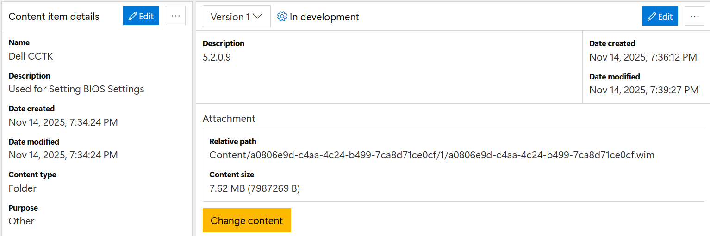
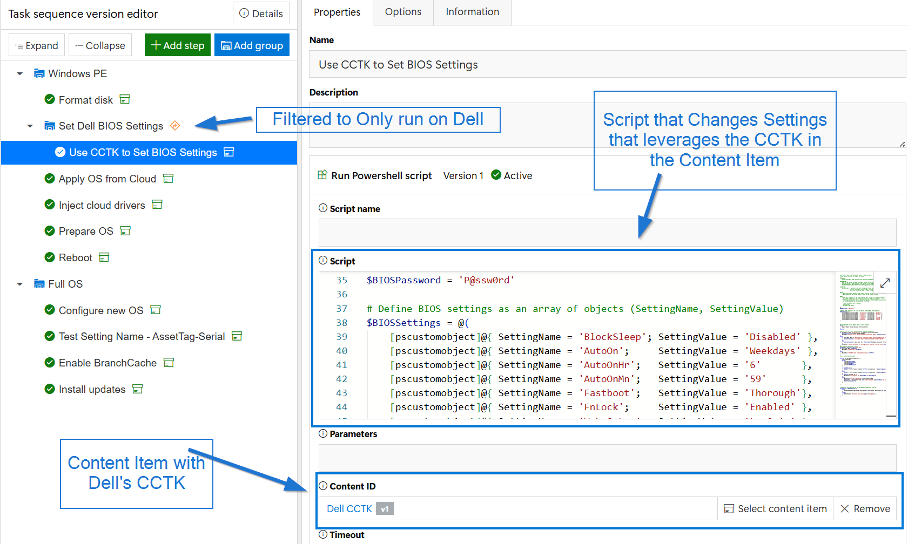
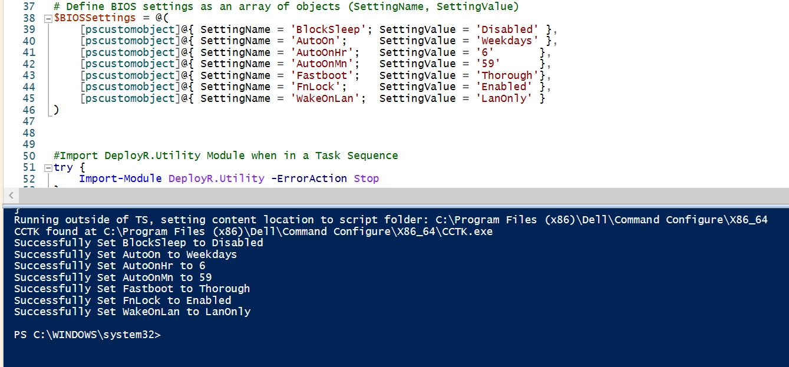

# Dell - Setting BIOS Settings using CCTK

One might ask, why are you using CCTK, isn't that old school?  Yes, yes it is.  However I've had bad luck recently getting other methods to work in WinPE and finally threw in the towel and decided to go with one that works 100% of the time, CCTK.

## Creating the CCTK Content Item

### Download Content and Install
Download Dell Command | Configure - You can always find the latest version here: https://github.com/mkaptano/tools/

### Get the CCTK Files after Installation
Once you've downloaded and installed it on an endpoint, browse to: C:\Program Files (x86)\Dell\Command Configure\X86_64.  Grab all of the contents from here and copy them to your DeployR Content Item Source, ex: \\214-DEPLOYR\DeployRContentItems\Source\ContentItems-Other\DellCCTK

### Create Content Item in DeployR

In the Content Items node, click Add and fill in the information.

This will drop you at the Content Item, click "New Version", then add a decription and click save.  I like to put the version number in for reference.

Click "Choose File", then browse to the source folder you copied the contents too and click upload.

There will be a prompt to upload multiple files, click "Upload"

It will then provide a list of tiles, click "Upload All" in the bottom left.  It will then upload the files to the DeployR Content Item, and display the information.

A content item for CCTK is now available to be used during the Task Sequence.

## Using CCTK with PowerShell in Task Sequence

Now that there is a CCTK Content Item that can be used, a script can be created to set the required BIOS settings.  Read the CCTK documentation for a deeper dive, but I'll cover a couple of basics here.

Using the Sample Script "SetDellBIOSSettings.ps1",  it will show how it grabs the content location during the DeployR Task Sequence to find the CCTK.exe file needed.  

By setting the BIOS Settings in the script, it will loop through and set them to the desired value.

You can also test the script outside of DeployR on a Dell that has the CCTK installed to the default location.

And testing script standalone on endpoint outside of Task Sequence:

