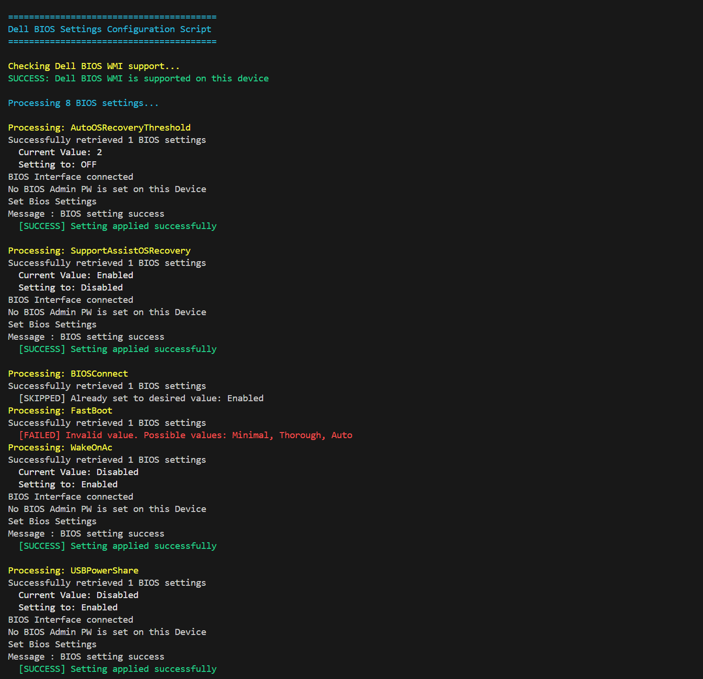
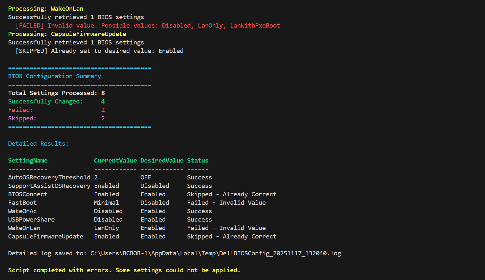
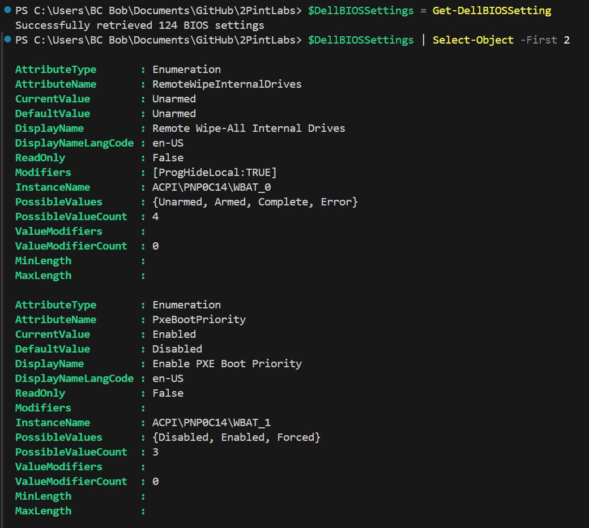
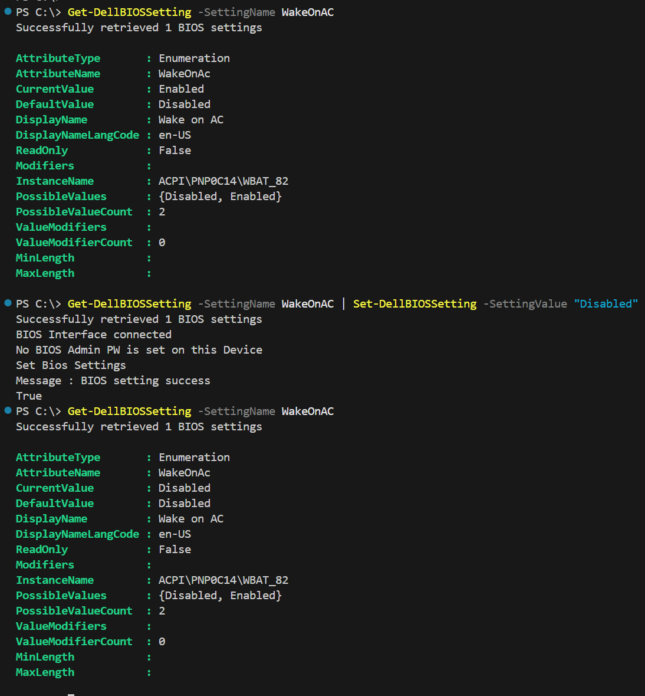

# Dell Native WMI

Custom PowerShell functions to get and set BIOS settings which work in WinPE as well as the Full OS.

This solution uses native Dell WMI classes (no external tools required) and supports both EnumerationAttribute (predefined values) and StringAttribute (text-based) BIOS settings.

## Credits

- **Sven Riebe** ([@SvenRiebe](https://github.com/svenriebedell)) for the original Dell BIOS management implementation
- Reference: [Intune_11_Detection_BIOS_setting_compliant.ps1](https://github.com/svenriebedell/Intune/blob/main/Remediation/Intune_11_Detection_BIOS_setting_compliant.ps1)

## Files

- **SetDellBIOSSettingsWMI-Functions.ps1** - Core functions with comprehensive documentation
- **SetDellBIOSSettingsWMI-Example.ps1** - Working example script that demonstrates configuring multiple BIOS settings

>[!Note]
>The SetDellBIOSSettingsWMI-Example.ps1 would be the script you add to your Task Sequence and modify for your environment.

## Custom Dell Functions

### Test-DellBIOSWMISupport

Verifies if the device supports Dell BIOS WMI management. This is useful to check compatibility before attempting BIOS operations.

**Returns:** `$true` if supported, `$false` if not supported

**Examples:**

```powershell
# Check if device supports Dell BIOS WMI
if (Test-DellBIOSWMISupport) {
    Write-Host "Device is compatible"
} else {
    Write-Host "Device does not support Dell BIOS WMI"
}
```

---

### Test-DellBIOSPassword

Checks if a BIOS Admin or System password is currently set on the device. Useful for conditional logic before attempting BIOS changes or password operations.

**Parameters:**

- `PasswordType` (optional) - Type of password to check: "Admin" (default), "System", or "Both"

**Returns:** `$true` if password is set, `$false` if not set

**Examples:**

```powershell
# Check if Admin password is set
if (Test-DellBIOSPassword) {
    Write-Host "BIOS Admin password is set"
} else {
    Write-Host "No BIOS Admin password"
}

# Check if System password is set
if (Test-DellBIOSPassword -PasswordType "System") {
    Write-Host "System password is set"
}

# Check if either password type is set
if (Test-DellBIOSPassword -PasswordType "Both") {
    Write-Host "At least one password is set"
}
```

---

### Get-DellBIOSSetting

Retrieves BIOS settings from Dell devices. Can retrieve all settings or filter by a specific setting name. Returns PSCustomObjects with detailed information including current values, possible values, read-only status, and more.

**Parameters:**

- `SettingName` (optional) - Name of a specific BIOS setting to retrieve

**Returns:** Array of PSCustomObjects containing BIOS setting information

**Examples:**

```powershell
# Get all BIOS settings
$allSettings = Get-DellBIOSSetting

# Get a specific BIOS setting
$setting = Get-DellBIOSSetting -SettingName "FastBoot"
Write-Host "Current value: $($setting.CurrentValue)"
Write-Host "Possible values: $($setting.PossibleValues -join ', ')"

# Get Asset Tag (string-type setting)
$asset = Get-DellBIOSSetting -SettingName "Asset"
Write-Host "Asset Tag: $($asset.CurrentValue)"
Write-Host "Max Length: $($asset.MaxLength)"

# Export all settings to CSV for documentation
Get-DellBIOSSetting | Export-Csv -Path "C:\Temp\BIOSSettings.csv" -NoTypeInformation

# Find all read-only settings
Get-DellBIOSSetting | Where-Object { $_.ReadOnly -eq $true }

# View only string-type settings
Get-DellBIOSSetting | Where-Object { $_.AttributeType -eq "String" } | Format-Table AttributeName, CurrentValue, MaxLength
```

---

### Set-DellBIOSSetting

Modifies Dell BIOS settings. Automatically detects if a BIOS password is set and handles authentication accordingly. Supports setting regular BIOS settings, managing passwords, and pipeline input from Get-DellBIOSSetting.

**Parameters:**

- `SettingName` (required) - Name of the BIOS setting to modify
- `SettingValue` (required) - New value for the setting
- `BIOSPW` (optional) - BIOS Admin password (required only if password is set)

**Returns:** `$true` if successful, `$false` if failed

**Note:** Some settings may require a system reboot to take effect.

**Examples:**

```powershell
# Set a BIOS setting without password protection
Set-DellBIOSSetting -SettingName "FastBoot" -SettingValue "Disabled"

# Set a BIOS setting with password protection
Set-DellBIOSSetting -SettingName "WakeOnLan" -SettingValue "Enabled" -BIOSPW "YourPassword"

# Use pipeline to get and set a setting
Get-DellBIOSSetting -SettingName "Asset" | Set-DellBIOSSetting -SettingValue "ABC12345"

# Set BIOS Admin Password for the first time
Set-DellBIOSSetting -SettingName "Admin" -SettingValue "NewPassword123"

# Change existing BIOS Admin Password
Set-DellBIOSSetting -SettingName "Admin" -SettingValue "NewPassword456" -BIOSPW "NewPassword123"

# Clear BIOS Admin Password
Set-DellBIOSSetting -SettingName "Admin" -SettingValue "ClearPWD" -BIOSPW "NewPassword456"
```

---

### Set-DellBIOSAdminPassword

Simplified function to manage the Dell BIOS Admin password. Automatically detects if a password is currently set and performs the appropriate operation (set, change, or remove). This is an easier alternative to using `Set-DellBIOSSetting` for password management.

**Parameters:**

- `CurrentPassword` (optional) - Current BIOS Admin password (required when changing or removing)
- `NewPassword` (required for set/change) - New BIOS Admin password to set
- `RemovePassword` (switch) - Remove the current BIOS Admin password

**Returns:** `$true` if successful, `$false` if failed

**Note:** Uses parameter sets to ensure correct parameter combinations are used.

**Examples:**

```powershell
# Set BIOS Admin password for the first time (no current password)
Set-DellBIOSAdminPassword -NewPassword "MySecurePassword123"

# Change existing BIOS Admin password
Set-DellBIOSAdminPassword -CurrentPassword "OldPassword123" -NewPassword "NewPassword456"

# Remove/clear BIOS Admin password
Set-DellBIOSAdminPassword -CurrentPassword "CurrentPassword123" -RemovePassword

# Conditional password management with detection
if (Test-DellBIOSPassword) {
    # Password is set, change it
    Set-DellBIOSAdminPassword -CurrentPassword "Current123" -NewPassword "New456"
} else {
    # No password set, set new one
    Set-DellBIOSAdminPassword -NewPassword "New456"
}
```

---

## Console Output

### Example Script

In the console running the Example Script.  I've set some SettingValues incorrectly, using ones that don't exist so you can see the output, it was totally on purpose.



### Individual Functions


