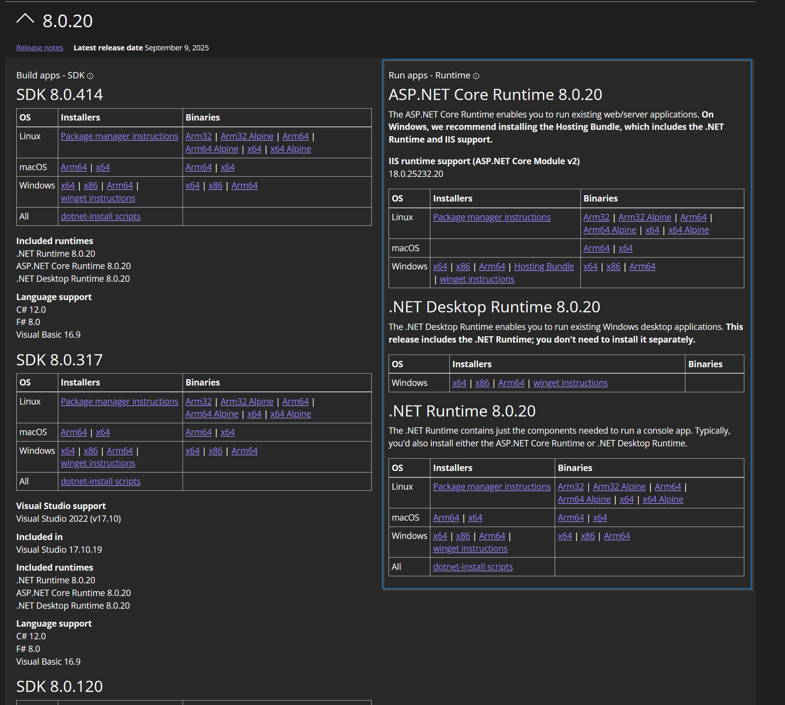

# DeployR Setup

This is my lab setup, super simple.

I've already installed StifleR 2.14 but just slightly different then the guide I posted in the StifleR folder her on GitHub.  This server is Workgroup, so the certs I'm using are Self Signed based on a CA cert that comes with the 2PXE server from 2Pint Software.  If you're looking for help with StilfeR Setup, check out the StifleR folder here on GitHub

- Windows Server 2025 Standard
  - HyperV VM | 8GB RAM | C: = 120GB | D: = 400 GB (DeployR Content Items)
- Name: 214-DeployR
- FQDN: ....  I'm just using a WorkGroup, no Domain Join.. but I'm using the DNS suffix of 2p.garytown.com
- Certificates are from the 2PXE installation, more on that later.
- User Account (local): gary.blok - Full Admin - Used for all installs

## PreReqs

- MS Junk
  - ASP.Net Core 8.0.XX (Latest) - See Image below for reference (NOT SDK!!!)
    - .NET RUntime
    - .Net Desktop Runtime
    - ASP.NET Core Runtime
  - MS ADK & WinPE (Latest)
  - PowerShell 7.4.X
  - SQL Express
    - Make sure you add NT AUTHORITY\SYSTEM to dbcreator role (in SSMS)
  - SQL Management Studio (Optional)



- Server Changes:
  - BC:

  ```PowerShell
  Install-WindowsFeature BranchCache
  ```

  - IIS

  ```PowerShell
  Install-WindowsFeature -Name Web-Server, Web-Windows-Auth -IncludeManagementTools
  ```
  
  - Firewall for DeployR:

```PoweShell
# Firewall rule 7281 (HTTPS) & 7282 (HTTP)
New-NetFirewallRule -DisplayName "2Pint DeployR HTTPS 7281" -Direction Inbound -LocalPort 7281 -Protocol TCP -Action Allow
New-NetFirewallRule -DisplayName "2Pint DeployR HTTP 7282" -Direction Inbound -LocalPort 7282  -Protocol TCP -Action Allow
```

- StifleR 2.14
  - Server
  - Dashboard

NOTE:  I installed 2PXE on the same server, which created self-signed certificates using the 2PintSoftware CA.  I then used Intune to push the 2PintSoftware CA Cert to all of my devices.
2Pint CA Cert located: "C:\Program Files\2Pint Software\2PXE\x64\ca.crt"

I set 2PXE to override and create the cert based on the FQDN, then deleted the certificate from Personal Certificates, and the Certificates folder from C:\ProgramData\2Pint Software\2PXE\Certificates, and restarted the 2PXE service so it would regenerate those certs for me based on the 2PintSoftware CA included in 2PXE


 I setup IIS to use the certificate in the


## DeployR Config File Changes

- CertificateThumbprint = the Thumbprint you're using for HTTPS in IIS
- ConnectionString = Server=.\SQLEXPRESS;Database=DeployR;Trusted_Connection=True;MultipleActiveResultSets=true;TrustServerCertificate=True
- ContentLocation = D:\DeployRContentItems | Set this to what works good for you, I setup a separate volume just for the content, which I'll enable deduplication on.
- ClientURL = <https://FQDN:7281> | <https://214-DeployR.2p.garytown.com:7281>
- JoinInfrastructure = TRUE (turned On)
- StifleRServerApiURL: <https://FQDN:9000> | <https://214-DeployR.2p.garytown.com:9000>

## Post Installation

So once you get to this point, you'll want to make sure the services are all running, and you can pull up DeployR in the Dashboard.  
In the Dashboard, Administration -> Infrastructure services, in the service list, DeployR will show up, under actions, click the ... and chose approve.
Then it's time to build some boot media.

### Boot Media

Use the Console to create it, then find it on the D:\DeployRContentItems\Content\Boot

- Create a Content Item (Other) with your Root Certificates
- Create a Content Item (DriverPack) with your WinPE Drivers
- Go to Boot Media Page in DeployR, click Generate and wait... monitor the status by refreshing the browser, or monitoring the Log on the DeployR Server
  - DeployRContentLocationPath\Logs\00000003-0000-0000-0000-0000000001.log
- Once complete, you will find 2 ISO's there and 2 wim files.
- For iPXE use the winpe_amd64.wim (assuming you're booting x64)
- For VM mounting an ISO, grab either the DeployR_X64 or noprompt ISO.  noprompt is helpful for automation.
