# JSON Driven FrontEnd

> [!IMPORTANT]
> This is my personal GitHub, while I work for 2Pint Software, this is not a supported frontend, anything you find here you can borrow, but it's use at your own risk, and self-supported.

## Files

- Frontend PowerShell Script
- JSON Config File
- Logo File (png)

All files need to be in the same folder so they can reference each other when running.

## JSON File

The JSON file has several sections, you'll want to update each for your environment.  If you don't plan to use specific parts of the Frontend, just clear out the options for it in the JSON, but don't delete the main section.  

## Frontend

The Frontend script is called "FronEnd-JSONBased.ps1", this is the main script that you can then run on your computer to see how it works.

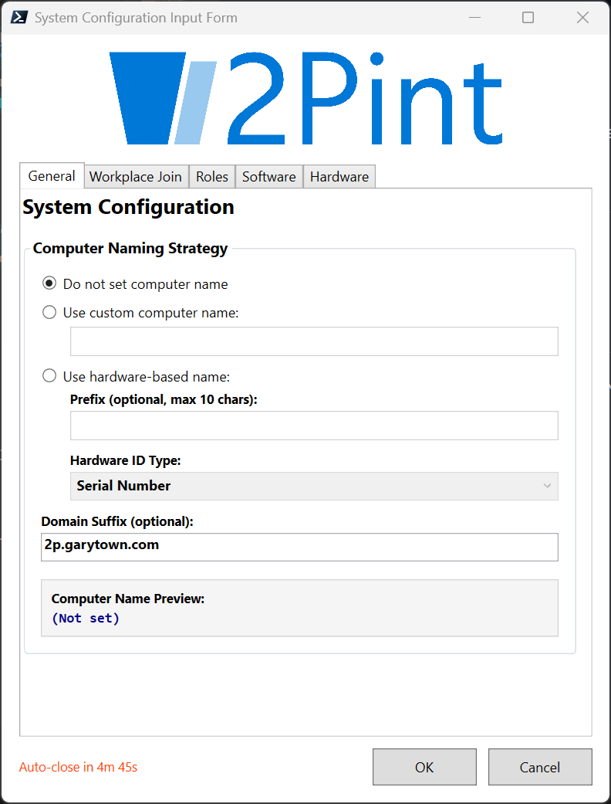

There are several tabs that each have different areas to select or display data

- General
- Workplace Join
- Roles
- Software
- Hardware

### General

Here is where we set the Computer Name.  There are several method in which you can do this.

- Do not set computer name:  This will not set the variable and let future processes in DeployR set your name for you, either the default, or if you're using another script later.
- Use custom computer name:  You manually type in a name
- Use hardware-based name. Set the Computer Name based on a hardware attribute of the device
  - **Serial Number**
  - **MAC Address**
  - **Asset Tag**
  - You can also add a custom pre-fix which will come before the hardware info.
  - IE: PreFix-SerialNumber
  - EX: 2P-7GE532
- Computer Name Preview, this will display the FQDN of the name that will be populated

#### General Variables

- **NamingStrategy** (None, Manual, HardwareBased) - not used by DeployR by Default
- **ComputerName** - used by DeployR to set the name of the computer during OOBE
- **DomainSuffix** - not used by DeployR by Default, but available if you want to use it

### Workplace Join

Here we can set the final environment of the device once it's done, based on the option you choose, submenus will appear

- **Local Workgroup**
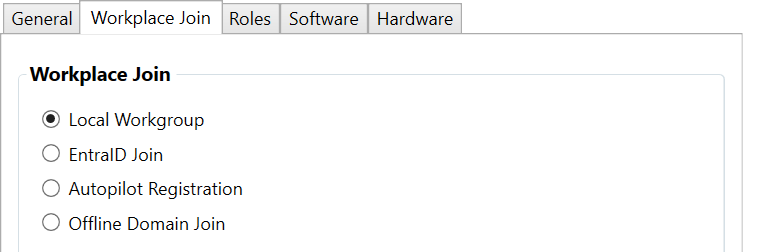
- **EntraID Join**
  - Add the Primary User UPN (Manually)
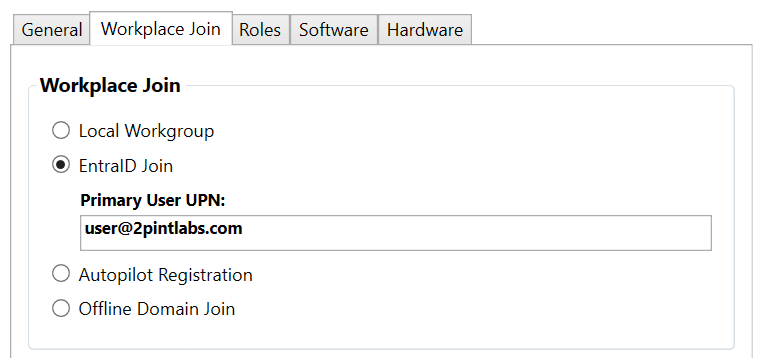
- **Autopilot Registration**
  - Select the Group Tag from a Drop Down (pulled from JSON file)
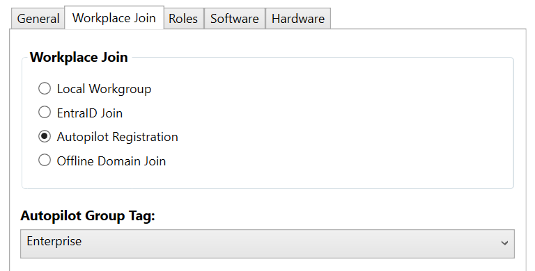
- **Offline Domain Join**
  - Select the OU from the Drop Down (pulled from JSON file)
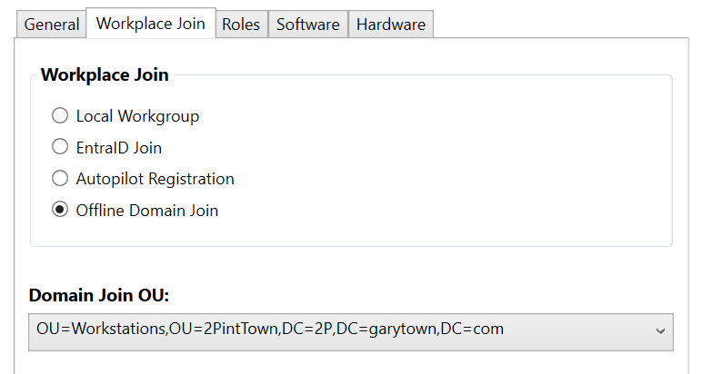

#### Workplace Join Variables

- **WorkPlaceJoin** (Workgroup, EntraID, Autopilot, ODJ) - not used by DeployR by Default
- **AutopilotGroupTag** - Not used by DeployR by Default, I leverage to have different steps get called with different configs in the steps
- **EntraIDUserUPN**  - not used by DeployR by Default
- **ENTRAUPN** - Used By DeployR's "Set Intune device Owner" Step. If this is set ahead of time, it will ignore the value you put in that specific step allowing the process to be dynamic based on the front end.
- **DomainJoinOU** - Not used by DeployR by Default
- **OU** - Used by the Offline Domain Join Step to know which OU to join the device to
-

#### Examples

I just those variables created to set conditions on different folders which have the corresponding steps in them.  This allows me to use the same TS for all different environments.

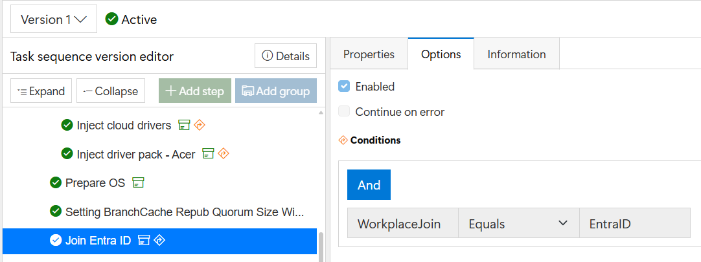
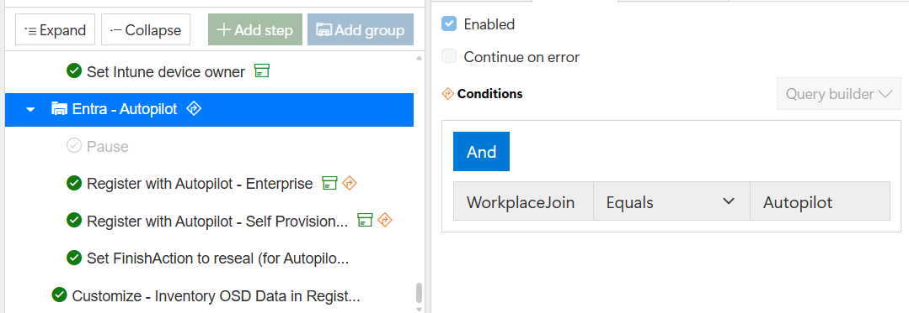
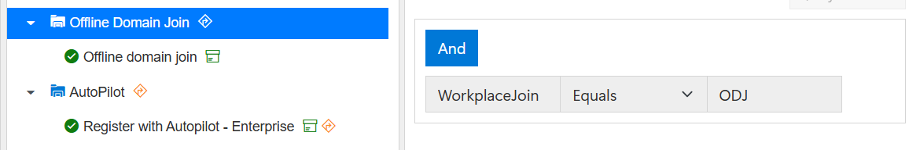

### Roles

This was created to do completely custom and dynamic task sequence sections based on a "Role" you want to deploy to.  It's 100% custom by you.  I created a few items for the template, but really only use this if I'm doing family computers in my lab, and if I pick the Family Role, it skips a bunch of things in the task sequence. These roles are populated by the JSON file.

#### Role Variables

- **SelectedUserRole**  - not used by DeployR by Default

### Software

This list of applications is dynamically pulled from the JSON file.  The Friendly Name and variable name are set in the JSON file.

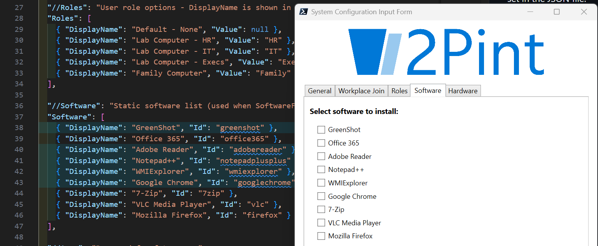

#### Software Variables

The process will loop through all of the applications in the list and create a variable for each one called "Install_softwareid" = True or False.  Using those variables, you can then set them as conditions on the Application Install step in the Task Sequence.

#### Other Notes on Software
Long term goal would be to make this software list dynamic based on a Tag in DeployR.  The Task Sequence would ask the DeployR server "What software do you have" then populate the list in the Frontend based on the return from the server, however that's a future state and for now, this was a simple method to setup software selections.

### Hardware

This is just read only, something nice to see when your imaging. Similar to what BGInfo would display, but shown in the front end instead.

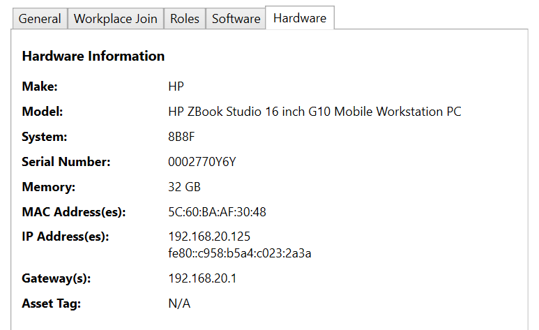

## Running Manually outside of Task Sequence

I've setup the frontend so you can call the powershell script and see the output.  It's not 100% the same as in the Task Sequence, but lets you do some testing.  This is how I was able to grab screen captures. I ran it from VSCode

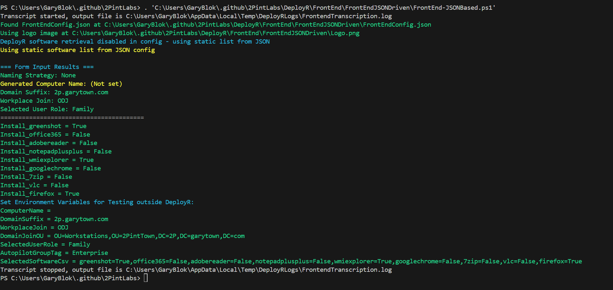

