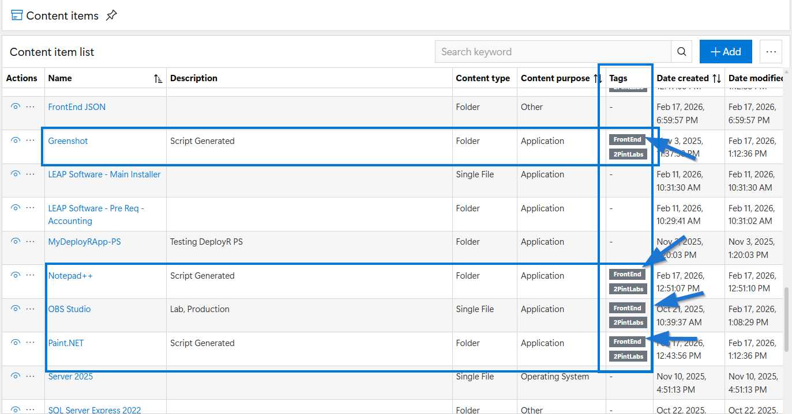
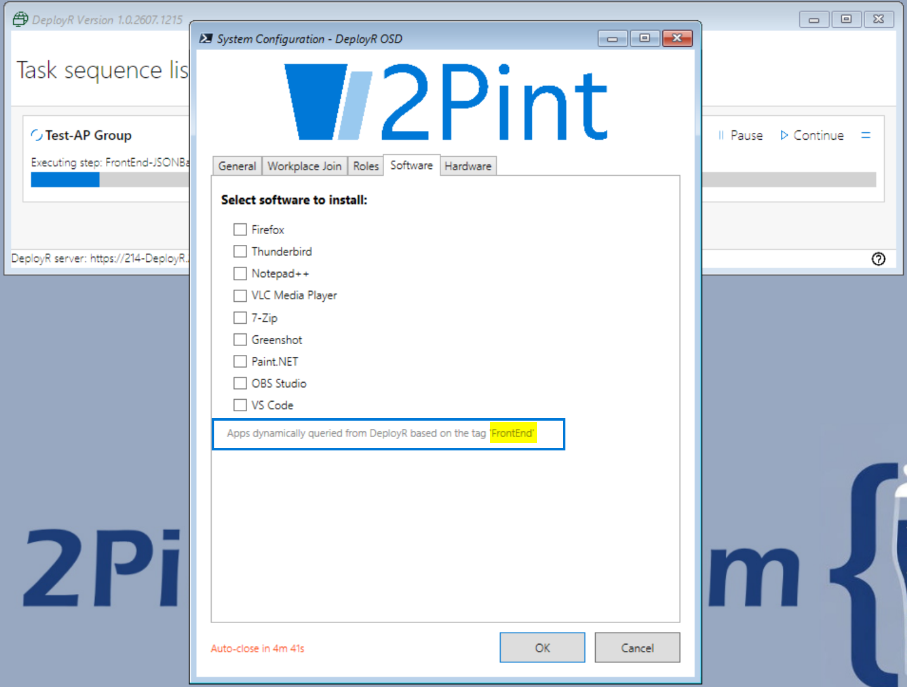
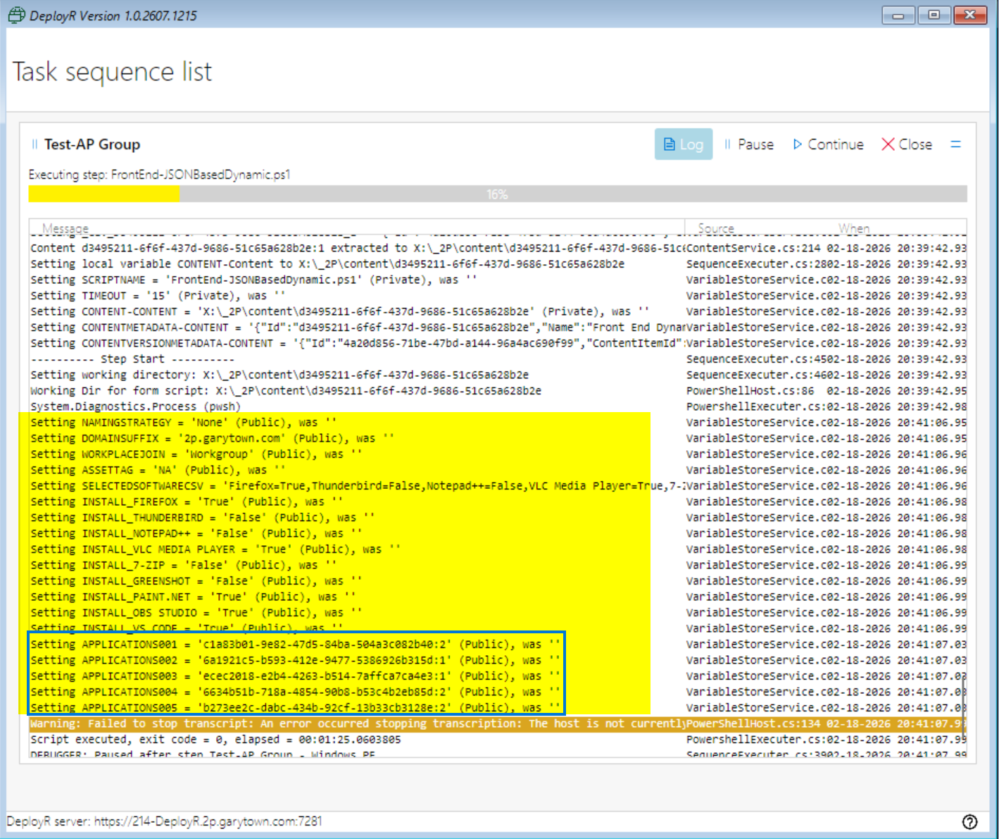
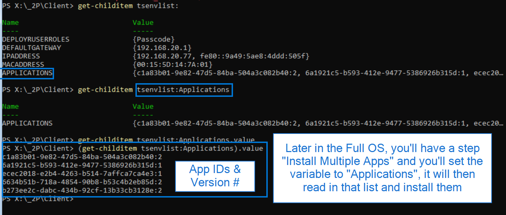
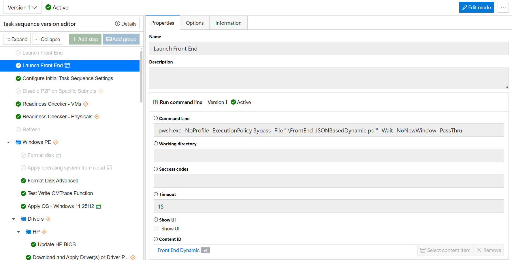
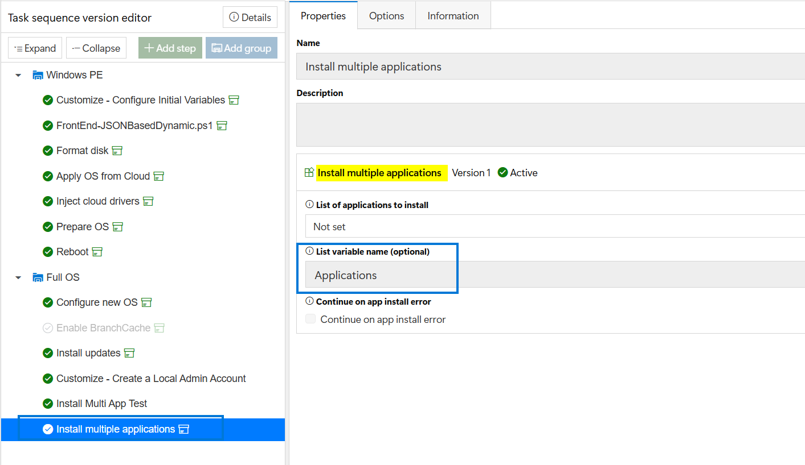
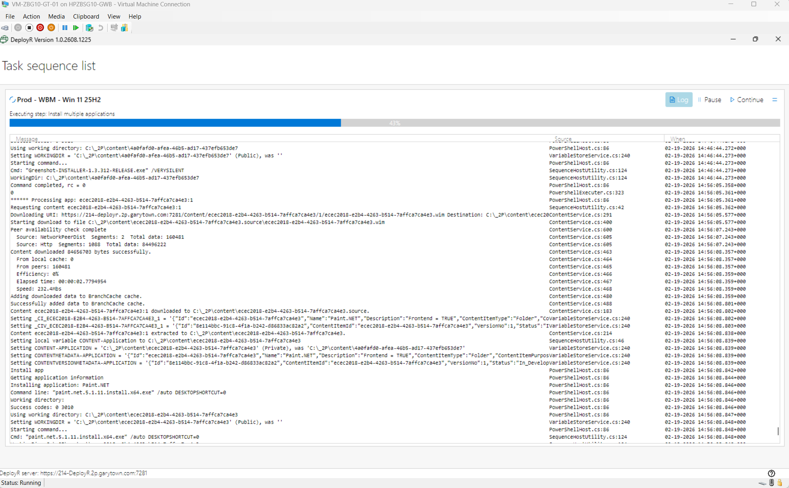

# JSON Driven Dynamic Apps FrontEnd

> [!IMPORTANT]
> This is my personal GitHub, while I work for 2Pint Software, this is not a supported frontend, anything you find here you can borrow, but it's use at your own risk, and self-supported.

## Files

- Frontend PowerShell Script
- JSON Config File
- Logo File (png)

All files need to be in the same folder so they can reference each other when running.

## JSON File

The JSON file has several sections, you'll want to update each for your environment.  If you don't plan to use specific parts of the Frontend, just clear out the options for it in the JSON, but don't delete the main section.  

## Frontend

OK, you can look at the docs in the FrontEndJSONDriven folder to learn most things, I'm just going to cover the part that makes this different.

This one was purposely adjusted for DeployR environments.  I didn't remove the ConfigMgr Code, which I will probably do in the future, I just updated to allow the Software page to dynamically pull a list of software from the DeployR server based on a Tag you set on the application.

In the JSON File, you'll need to set these to items:
  "SoftwareFromDeployR": "True",
  "SoftwareFromDeployRTag": "FrontEnd",

The SoftwareFromDeployRTag will be whatever Tag you set on the apps in DeployR Dashboard


Those are some of the apps I have in DeployR that are tagged with "FrontEnd" so when the Front End is run in the Task Sequence, it will query DeployR and return those apps.



Once you make a selection, it will create the variables when the Frontend closes:



The Magic is that variable: TSENVLIST:APPLICATIONS, that will be the variable that gets pulled into the "Install Multiple Apps" step later.



The Frontend you just call the PowerShell script: (After you made a content item with the PowerShell Script, Logo & JSON file)


Then later in the Task Sequence you call the step to install the apps:



There you have it.
Now in the Task Sequence:



## Avalonia test notes

This copy uses Avalonia instead of WPF. The DeployR client must contain the Avalonia assemblies used by the script, including `Avalonia.Markup.Xaml.Loader.dll`. DeployR 1.3 may require the loader files to be copied into the client folder and the DeployR service restarted, as described in the Deployment Research article.

For a first test:

1. Copy this folder as a content item, including the PowerShell script, `FrontEndConfig.json`, and `Logo.png`.
2. Add a DeployR task-sequence PowerShell step that runs `FrontEnd-JSONBasedDynamicAvalonia.ps1`.
3. Run the task sequence in a disposable VM or test device.
4. Exercise each tab, select a manual computer name, hardware-based name, workplace-join option, software item, and finish action.
5. Complete the form and verify the resulting task-sequence variables, especially the computer name, workplace join selection, finish action, P2P setting, and application list.
6. Repeat once with Cancel and once by allowing the five-minute timeout to confirm the task sequence receives a cancelled form result.

The script can be parsed locally with:

```powershell
$path = '.\FrontEnd-JSONBasedDynamicAvalonia.ps1'
[scriptblock]::Create((Get-Content -LiteralPath $path -Raw)) | Out-Null
```

The UI itself cannot be fully tested on a normal workstation unless the DeployR Avalonia client assemblies are available. The most representative test is a DeployR task sequence using the same Windows PE image and client version that will run the frontend.

If you have questions, post them on Reddit in the 2Pint DeployR area, or find me on Discord WinAdmins
