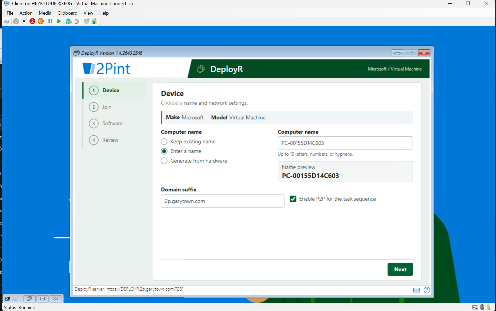
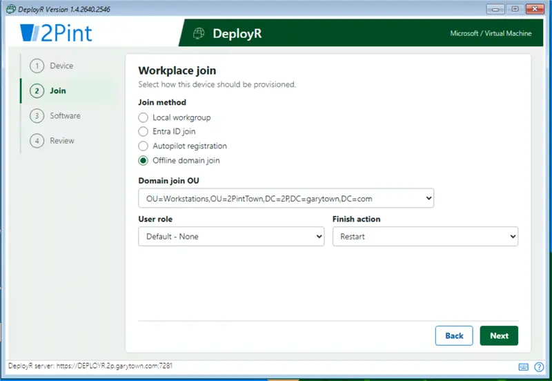
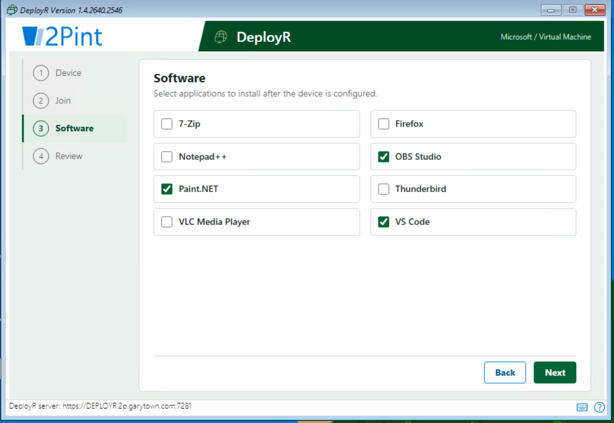
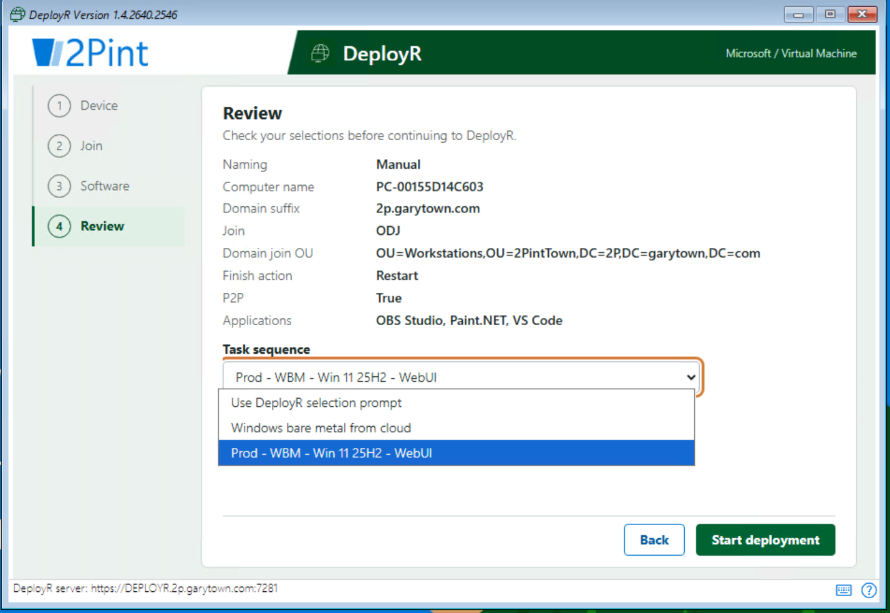

# DeployR WebUI

A self-hosted, JSON-driven setup wizard for DeployR's custom web page support. DeployR opens `WebUI.html` before task-sequence selection; the page collects device, join, locale, software, and task-sequence choices, then posts applicable task-sequence variables to `deployr://submit`. This is a community example, not an officially supported DeployR frontend. Test the complete handoff on your DeployR build before production use.

## Files

| File | Purpose |
| --- | --- |
| `WebUI.html` | Five-step wizard and native DeployR form submission. |
| `config.json` | Domain suffix, OUs, roles, Autopilot tags, catalog URLs, and optional default task-sequence ID. |
| `locale.json` | Time-zone, system/user locale, UI language, and keyboard options and defaults, extracted from the supplied Set Windows settings definition. |
| `Logo.png`, `DeployR-Icon.png` | Header artwork; host beside the HTML. |
| `Publish-WebUIApplications.ps1` | Queries DeployR for applications tagged `FrontEnd` and publishes `applications.json`. |
| `Publish-WebUITaskSequences.ps1` | Queries DeployR for task sequences tagged `FrontEnd` and publishes `tasksequences.json`. |
| `Set-WebUIApplications.ps1` | Runs later **inside the selected task sequence** to turn selected application IDs into `TSENVLIST:Applications`. |
| `URL-Variables.md` | Bootstrap URL template, supported query inputs, and posted variable names. |

The generated `applications.json` and `tasksequences.json` files are not checked in; run the publishers to create them. Both catalogs contain arrays of `{ "id": "<DeployR GUID>", "displayName": "Friendly name" }` objects. The browser never uses a DeployR passcode or queries the DeployR PowerShell module directly.

## Setup

1. Host `WebUI.html`, `config.json`, `locale.json`, `Logo.png`, and `DeployR-Icon.png` together on an HTTPS webserver reachable from WinPE. Serve HTML as `text/html`, JSON as `application/json`, and images as `image/png`. A content/download endpoint that returns HTML as `application/octet-stream` will cause the browser to download it instead of displaying the wizard.
2. Adjust `config.json` for your domain suffix, OUs, roles, Autopilot tags, and optional `taskSequenceId`. Its `applicationsUrl` and `taskSequencesUrl` point to `applications.json` and `tasksequences.json` in the same directory. An ID from config or the URL is preselected only if it appears in the published `FrontEnd` task-sequence catalog.
3. Tag the desired applications and task sequences `FrontEnd` in DeployR. On a machine with `DeployR.Utility` access and working DeployR authentication, place the two publish scripts in the hosted WebUI directory and run:

   ```powershell
   .\Publish-WebUIApplications.ps1
   .\Publish-WebUITaskSequences.ps1
   ```

   Each script writes its JSON file beside itself by default. If stored elsewhere, pass `-OutputPath 'C:\inetpub\wwwroot\WebUI\applications.json'` or the corresponding task-sequence path. `-Tag` defaults to `FrontEnd`. Run both once before opening the page; schedule them on the server if the tagged catalogs change. They do not set task-sequence variables.
4. Set `CustomWebUrl` in DeployR's `Bootstrap.json` (or supply it through 2PXE/iPXE) using the full example in [URL-Variables.md](URL-Variables.md). If you want the System and Network sidebar to show WinPE inventory, run `Create-ExtraVariables.ps1` before DeployR expands that URL so its `PA_` variables exist. Verify substitutions on your build and URL-encode values when needed. The page cannot read hardware identifiers or the client hostname directly from Windows/WinPE.

## Wizard and task-sequence handoff

- **Device:** Keep the existing computer name (default), enter a name, or generate one from a MAC address or serial number provided in the URL. Manual naming starts with a MAC-based suggestion when available. Hardware naming keeps the rightmost identifier characters so the resulting `PC-...` name fits the 15-character limit. The System and Network sidebar displays read-only `PA_` inventory passed in the URL, using `NA` for missing values. A populated `hostname` also updates the current-name preview; without it, the page says "Current name unavailable" and does not post a replacement `ComputerName` when keeping the name.
- **Join:** Choose workgroup, Entra ID, Autopilot, or offline domain join. The page shows relevant UPN, group-tag, or OU inputs and limits finish actions by join type. It also collects the optional role and P2P setting.
- **Locale:** Choose time zone, system locale, user locale, UI language, and input locale. Defaults are Central Standard Time and en-US with the English `0409:00000409` keyboard. Edit `locale.json` to change defaults or restrict options; `defaultDisplayName` disambiguates keyboard entries sharing the same code. The five selections are posted as `TimeZone`, `SystemLocale`, `UserLocale`, `UILanguage`, and `InputLocale`. No progress timeout is added. A missing or invalid locale catalog blocks submission rather than silently applying unspecified settings.
- **Software:** Choose from the published `FrontEnd`-tagged application catalog. If it cannot be fetched, the page warns and uses the `applications` fallback in `config.json` (empty by default).
- **Review:** Inspect choices and select a published `FrontEnd`-tagged task sequence. `taskSequenceId` from config (or `?tsid=` from the URL) is selected only when present in the catalog. Choose **Use DeployR selection prompt** to omit `TSID` and retain DeployR's built-in task-sequence picker. If the task-sequence catalog is unavailable, the page leaves `TSID` blank.

**Start deployment** sends the selected values through a native form POST to `deployr://submit`. A selected `TSID` skips DeployR's normal task-sequence prompt. Application selections are posted as a comma-separated `SelectedApplicationIds` value; a browser form cannot directly create the `TSENVLIST:Applications` array required by Install Multiple Applications.

The white header beside the 2Pint logo shows **Automatically closing in 5:00**. The countdown starts after setup data has loaded; navigation and edits do not reset it. At expiry, the wizard submits the **current selections**, preserving any edits. An untouched page submits its initial defaults. Invalid input prevents continuation and displays "Needs attention"; the operator can correct it and submit manually. Manual submission stops the timer, and a page with failed setup does not automatically continue. This hands control back to DeployR through the form submission, rather than attempting to close the browser window.

Locale output names follow the existing `Set-InitialVariables.ps1` mapping, rather than its `Initial...` step-option names. Ensure later task-sequence steps consume the posted variables without overwriting them with fixed settings. UI language availability also depends on the Windows image and installed language packs; the dropdown does not install language packs.

If using software selections, add `Set-WebUIApplications.ps1` as a PowerShell step in the task sequence **after the web wizard and before Install Multiple Applications**. It reads `SelectedApplicationIds`, queries tagged DeployR apps for their current versions, and sets `TSENVLIST:Applications`. It does nothing when no apps were selected. Confirm that `DeployR.Utility`, its authentication, and the posted variable are available in that task-sequence context.

## Demo

These screenshots show the earlier four-step layout; the current wizard also includes Locale between Join and Software.

**1. Device:** A MAC-suggested manual computer name, name preview, domain suffix, and P2P option.



**2. Join:** Offline domain join with OU, role, and finish-action choices.



**3. Software:** Published applications presented as checkboxes; the example selects OBS Studio, Paint.NET, and VS Code.



**4. Review:** Summary of selections and the task-sequence dropdown, including the option to use DeployR's own selection prompt.


