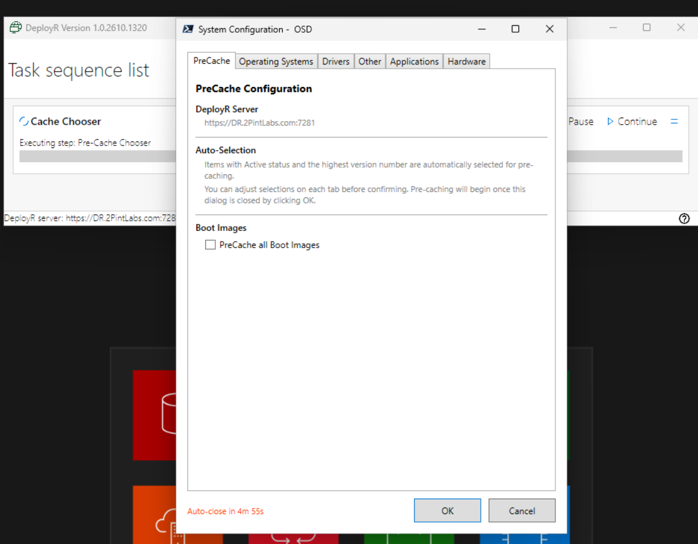
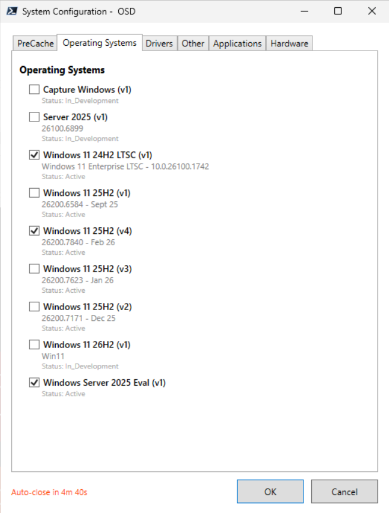
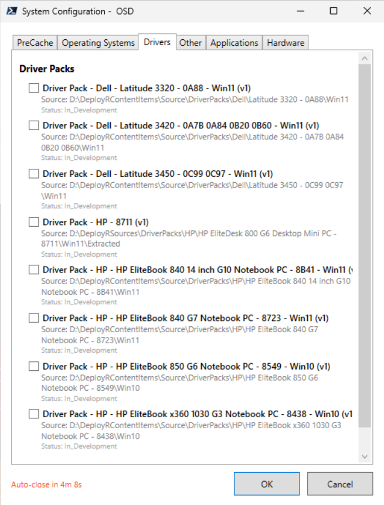
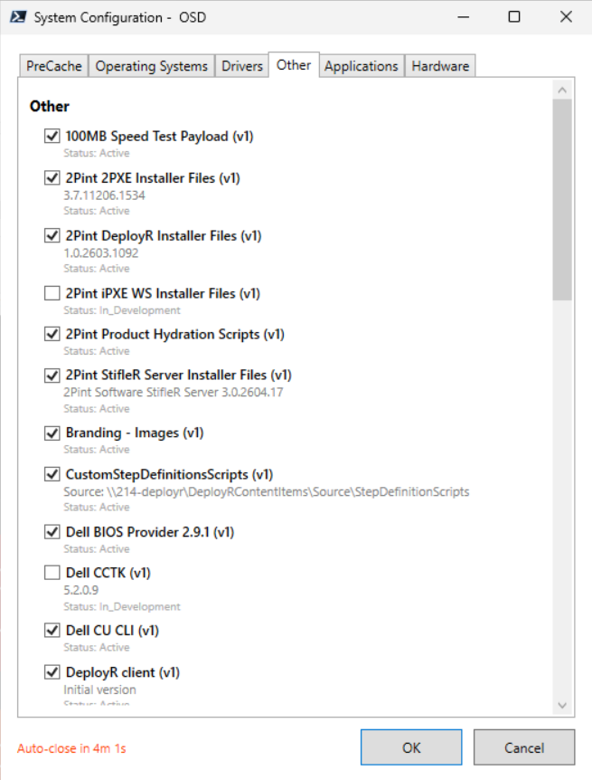
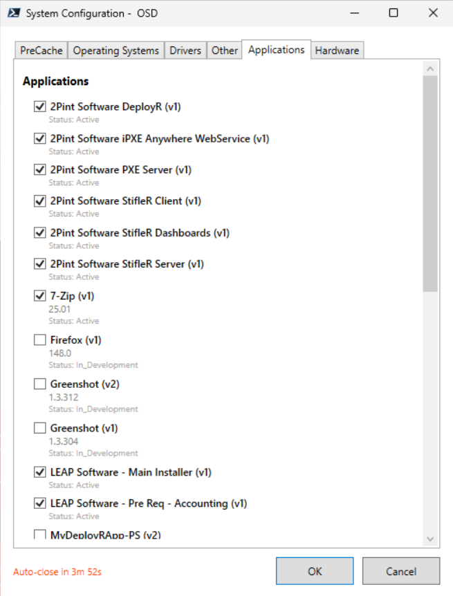

# Frontend for PreCache Content

> [!IMPORTANT]
> This is my personal GitHub, while I work for 2Pint Software, this is not a supported frontend, anything you find here you can borrow, but it's use at your own risk, and self-supported.

## Files

- FrontEnd-PreCacheChoose.ps1 - Script that contains the frontend to select the content, then outputs a JSON file
- PreCacheContent.ps1 - The Script that will download the content based on the JSON file.

## Setup

1) Create a content item with the two scripts found in this Folder

2) Create a new task sequence from template, choose the "Cache All" template, then edit it.
    Keep the "Enable BranchCache" step, delete the other one.

3) Add a "Run Command Line Step", reference the content item with the scripts, set the Command Line to:
```
pwsh.exe -NoProfile -ExecutionPolicy Bypass -File ".\FrontEnd-PreCacheChooser.ps1" -Wait -NoNewWindow -PassThru
```

4) Create a "Run PowerShell script" step, either embed the script or reference the content item and put in the name of the script.

## PreCaching Content on Devices

To run the task sequence on devices already deployed in the environment, you'll leverage PowerShell (7) to trigger the Task Sequence, for more information, see: https://documentation.2pintsoftware.com/deployr/starting-a-task-sequence-in-an-existing-os

## Frontend Behavior

The front end will dynamically build a list of the content items in DeployR in the corresponding tabs.  It will auto select content items that are in a status of "Active" and the latest version of each content item. You can then uncheck or check additional items. 

It will display the following information about a content item:
- Content Name, version number
- Description (if NOT NULL)
- Status (Active, In_Development, Deprecated )

The frontend will automatically close after a few minutes, so if forgotten about, it will automatically close and start precaching the default selected items.

## Frontend Looks






